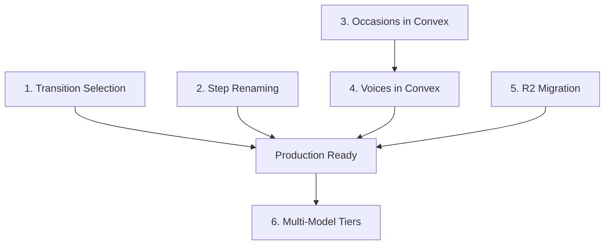

# 🏗️ MyShortReel - Architectural Improvements Sprint

**Date**: December 21, 2025  
**Status**: 📋 PLANNING  
**Goal**: Address architectural debt and improve scalability, modularity, and cost efficiency  
**Total Estimated Time**: ~63.5 hours (Phases 1-3) | ~123.5 hours (All Phases)  

---

## 📊 Executive Summary

This document analyzes six key architectural improvements identified during the codebase review. Each improvement is assessed for:
- Current state and problems
- Proposed solution
- Impact on existing features (especially i18n)
- Time estimation
- Priority and dependencies

### Quick Reference

| # | Improvement | Priority | Est. Hours | Dependencies |
|---|-------------|----------|------------|--------------|
| 1 | Transition Type Selection (Hard Cut vs Effects) | 🔴 HIGH | 11h | None |
| 2 | Step Renaming (Remove 2b, 3b) | 🟡 MEDIUM | 9.5h | None |
| 3 | Occasions/Emotions in Convex (+ illustrations) | 🟡 MEDIUM | 12h | None |
| 4 | Voice Choices in Convex (+ audio previews) | 🟡 MEDIUM | 13h | #3 (pattern) |
| 5 | Cloudflare R2 Migration | 🟠 HIGH-MEDIUM | 15-21h | None |
| 6 | Multi-Model Tier System | 🔵 LOW | 48-66h | None |

**Recommended Order**: 1 → 2 → 3 → 4 → 5 → 6

---

## 📋 Improvement #1: Transition Type Selection

### Current State

**Problem**: Users cannot choose between hard cut (no transition) and smooth transitions (xfade effects) for video assembly.

**Impact**:
- Hard cut: 3 scenes × 10s = **30s** final video
- Xfade (1s transitions): 3 scenes × 10s - 2 × 1s = **28s** final video

**Current Implementation** (`convex/actions/videoAssembly.ts:183-189`):
```typescript
mergeVideosWithXfade(sceneUrls, {
  transitionType: "circleopen",  // ❌ HARDCODED
  transitionDuration,
  clipDuration,
}),
```

**Files Involved**:
- `convex/actions/videoAssembly.ts` - Assembly action
- `lib/rendi-video-processing.ts` - Rendi API wrapper (supports 46 transition types)
- `app/[locale]/guided/step-5/page.tsx` - Final Review page (no transition UI)
- `app/[locale]/guided/step-6/page.tsx` - Premiere Night page (calls assembly)

### Proposed Solution

#### Option A: Add to Step 5 (Final Review) - **RECOMMENDED**
Step 5 already shows the storyboard - perfect place to add a "Transition Style" selector.

#### Option B: Add to Step 6 (Before Assembly)
Add UI before the "Assemble Final Video" button.

### Implementation Tasks

| Task | Description | Est. Hours |
|------|-------------|------------|
| 1.1 | Add `transitionType` field to projects schema | 0.5h |
| 1.2 | Create TransitionSelector component | 2h |
| 1.3 | Add transition UI to Step 5 page | 2h |
| 1.4 | Update `buildFinalVideo` action to accept transitionType | 1h |
| 1.5 | Update Step 6 to pass transitionType to assembly | 0.5h |
| 1.6 | Handle hard cut mode (skip xfade, use concat) | 2h |
| 1.7 | Update narration duration logic for hard cut | 1h |
| 1.8 | Add i18n strings for transition UI | 0.5h |
| 1.9 | Testing and QA | 1.5h |
| **TOTAL** | | **11h** |

### Schema Changes

```typescript
// convex/schema.ts - Add to projects table
transitionConfig: v.optional(v.object({
  mode: v.union(v.literal("hard_cut"), v.literal("xfade")),
  xfadeType: v.optional(v.string()), // "circleopen", "fade", "dissolve", etc.
  transitionDuration: v.optional(v.number()), // seconds (default: 1.0)
})),
```

### Narration Duration Impact

**For Hard Cut (no transitions)**:
```
Total video = numScenes × clipDuration
clipDuration = narrationDurationSec / numScenes
```

**For Xfade (with transitions)**:
```
Total video = (numScenes × clipDuration) - ((numScenes - 1) × transitionDuration)
clipDuration = (narrationDurationSec + totalTransitionTime) / numScenes
```

The existing `calculateClipDuration()` function in `videoAssembly.ts` already handles xfade mode. We need to add a branch for hard cut:

```typescript
function calculateClipDuration(
  narrationDurationMs: number,
  numScenes: number,
  transitionMode: "hard_cut" | "xfade",
  transitionDuration: number = 1.0,
): number {
  const narrationDurationSec = narrationDurationMs / 1000;
  
  if (transitionMode === "hard_cut") {
    // No overlap, simple division
    return Math.max(narrationDurationSec / numScenes, MIN_CLIP_DURATION);
  }
  
  // Xfade mode: account for overlaps
  const totalTransitionTime = (numScenes - 1) * transitionDuration;
  const clipDuration = (narrationDurationSec + totalTransitionTime) / numScenes;
  return Math.max(clipDuration, MIN_CLIP_DURATION);
}
```

### i18n Impact

All transition effects need proper translation support for names and descriptions.

Add to `messages/en.json`:
```json
{
  "guided_step5": {
    "transition_style": "Transition Style",
    "transition_mode_hard_cut": "Hard Cut",
    "transition_mode_hard_cut_desc": "Instant scene changes (30s total)",
    "transition_mode_xfade": "Smooth Transitions",
    "transition_mode_xfade_desc": "Cinematic effects between scenes (28s total)",
    "transition_type_label": "Transition Effect"
  },
  "transitions": {
    "circleopen": "Circle Open",
    "circleopen_desc": "Scene reveals from an expanding circle",
    "fade": "Fade",
    "fade_desc": "Smooth opacity transition between scenes",
    "fadeblack": "Fade to Black",
    "fadeblack_desc": "Fade out to black, then fade in next scene",
    "fadewhite": "Fade to White",
    "fadewhite_desc": "Fade out to white, then fade in next scene",
    "dissolve": "Dissolve",
    "dissolve_desc": "Gradual blend between two scenes",
    "wipeleft": "Wipe Left",
    "wipeleft_desc": "New scene wipes in from right to left",
    "wiperight": "Wipe Right",
    "wiperight_desc": "New scene wipes in from left to right",
    "slideup": "Slide Up",
    "slideup_desc": "New scene slides up from bottom",
    "slidedown": "Slide Down",
    "slidedown_desc": "New scene slides down from top",
    "slideleft": "Slide Left",
    "slideleft_desc": "New scene slides in from right",
    "slideright": "Slide Right",
    "slideright_desc": "New scene slides in from left",
    "circleclose": "Circle Close",
    "circleclose_desc": "Scene shrinks into a circle",
    "zoomin": "Zoom In",
    "zoomin_desc": "Zooming effect into next scene",
    "pixelize": "Pixelize",
    "pixelize_desc": "Pixelation effect during transition",
    "smoothleft": "Smooth Left",
    "smoothleft_desc": "Smooth sliding transition to the left",
    "smoothright": "Smooth Right",
    "smoothright_desc": "Smooth sliding transition to the right"
  }
}
```

### Future Enhancement: Transition Previews (Post-MVP)

**Goal**: Show a GIF or short video preview for each transition effect.

**Schema Addition** (for future):
```typescript
// Add to projects table or create new transitions table
transitionPreviews: defineTable({
  key: v.string(),              // "circleopen", "fade", etc.
  
  // Preview media
  previewGifUrl: v.optional(v.string()),   // GIF preview (lighter)
  previewVideoUrl: v.optional(v.string()), // MP4 preview (higher quality)
  previewR2Key: v.optional(v.string()),    // R2 storage key
  
  // Metadata
  durationMs: v.number(),       // Preview duration
  fileSize: v.number(),         // For loading optimization
  
  isActive: v.boolean(),
  createdAt: v.number(),
})
  .index("by_key", ["key"]),
```

**For MVP**: Display name + description only (translated)  
**Post-MVP**: Add animated GIF/video previews

### Transition Display Component

```typescript
// components/transitions/TransitionSelector.tsx
interface TransitionOption {
  key: XfadeTransitionType;
  // Future: previewUrl for GIF/video
}

const RECOMMENDED_TRANSITIONS: TransitionOption[] = [
  { key: "circleopen" },
  { key: "fade" },
  { key: "dissolve" },
  { key: "wipeleft" },
  { key: "slideup" },
  { key: "zoomin" },
];

export function TransitionSelector({ value, onChange }: Props) {
  const t = useTranslations("transitions");
  
  return (
    <div className="grid grid-cols-2 md:grid-cols-3 gap-3">
      {RECOMMENDED_TRANSITIONS.map((transition) => (
        <Card
          key={transition.key}
          className={cn(
            "cursor-pointer p-4",
            value === transition.key && "border-[#0d7ff2]"
          )}
          onClick={() => onChange(transition.key)}
        >
          {/* Future:  */}
          <div className="aspect-video bg-[#223649] rounded mb-2 flex items-center justify-center">
            <Sparkles className="h-8 w-8 text-gray-500" />
            {/* Placeholder for future GIF preview */}
          </div>
          <h4 className="font-medium">{t(transition.key)}</h4>
          <p className="text-sm text-gray-400">{t(`${transition.key}_desc`)}</p>
        </Card>
      ))}
    </div>
  );
}
```

---

## 📋 Improvement #2: Step Renaming (Remove 2b, 3b)

### Current State

**Problem**: The guided flow has confusing step names with "b" suffixes:

| Current | Description |
|---------|-------------|
| step-1 | Emotional Foundation |
| step-2 | The Story (Chat) |
| step-2b | Visual Style |
| step-3 | Visual Design (Scene Editor) |
| step-3b | The Narration (Chat) |
| step-4 | Sound Design |
| step-5 | Final Review |
| step-6 | Premiere Night |

**Issues**:
- Confusing UX for users navigating "Step 2b"
- URL structure is unclear
- Step indicators in headers show "Step 2b of 6" which is confusing

### Proposed Solution

Rename to sequential steps:

| Current | New | Description |
|---------|-----|-------------|
| step-1 | step-1 | Emotional Foundation |
| step-2 | step-2 | The Story (Chat) |
| step-2b | step-3 | Visual Style |
| step-3 | step-4 | Visual Design |
| step-3b | step-5 | The Narration |
| step-4 | step-6 | Sound Design |
| step-5 | step-7 | Final Review |
| step-6 | step-8 | Premiere Night |

### Implementation Tasks

| Task | Description | Est. Hours |
|------|-------------|------------|
| 2.1 | Rename directories: step-2b → step-3, etc. | 0.5h |
| 2.2 | Update all internal links (router.push, Link href) | 2h |
| 2.3 | Update StepHeader component (now 8 steps, not 6) | 1h |
| 2.4 | Update progress bar calculations | 0.5h |
| 2.5 | Update i18n keys (guided_step2b → guided_step3, etc.) | 1.5h |
| 2.6 | Add redirects for old URLs (optional, for bookmarks) | 1h |
| 2.7 | Update documentation | 1h |
| 2.8 | Testing all navigation paths | 2h |
| **TOTAL** | | **9.5h** |

### Files to Update

1. **Directories to rename** (⚠️ **RENAME IN DESCENDING ORDER** to avoid conflicts):
   ```bash
   # Step 1: Rename from LAST to FIRST to avoid overwrites
   mv app/[locale]/guided/step-6/  app/[locale]/guided/step-8/
   mv app/[locale]/guided/step-5/  app/[locale]/guided/step-7/
   mv app/[locale]/guided/step-4/  app/[locale]/guided/step-6/
   mv app/[locale]/guided/step-3b/ app/[locale]/guided/step-5/
   mv app/[locale]/guided/step-3/  app/[locale]/guided/step-4/
   mv app/[locale]/guided/step-2b/ app/[locale]/guided/step-3/
   # step-1 and step-2 stay unchanged
   ```
   
   | Order | Current | New |
   |-------|---------|-----|
   | 1st | step-6 → step-8 | ✅ No conflict |
   | 2nd | step-5 → step-7 | ✅ No conflict |
   | 3rd | step-4 → step-6 | ✅ step-6 already moved |
   | 4th | step-3b → step-5 | ✅ step-5 already moved |
   | 5th | step-3 → step-4 | ✅ step-4 already moved |
   | 6th | step-2b → step-3 | ✅ step-3 already moved |

2. **Files with internal navigation** (grep for `/guided/step-`):
   - All step pages (router.push, Link hrefs)
   - `components/shared/step-header.tsx`
   - API routes that redirect

3. **i18n namespaces** to rename:
   - `guided_step2b` → `guided_step3`
   - `guided_step3` → `guided_step4`
   - `guided_step3b` → `guided_step5`
   - etc.

### ⚠️ Migration Risk

This is a **breaking change** for:
- Active user sessions with URLs containing old step names
- Bookmarked URLs

**Mitigation**: Add temporary redirects:
```typescript
// middleware.ts - Add redirect rules
const STEP_REDIRECTS: Record<string, string> = {
  '/guided/step-2b': '/guided/step-3',
  '/guided/step-3b': '/guided/step-5',
  // ... etc
};
```

---

## 📋 Improvement #3: Occasions & Emotions in Convex

### Current State

**Problem**: Occasions and emotional themes are hardcoded in Step 1:

```typescript
// app/[locale]/guided/step-1/page.tsx:92-141
const occasions = [
  { id: "wedding", label: tOccasions("wedding"), icon: Heart, ... },
  { id: "birthday", label: tOccasions("birthday"), icon: Cake, ... },
  // ... 8 total
];

const emotionalThemes = [
  { id: "joyful", label: tStep1("emotional_theme_joyful_label"), ... },
  { id: "nostalgic", label: tStep1("emotional_theme_nostalgic_label"), ... },
  // ... 6 total
];
```

**Issues**:
- Adding new occasions requires code deployment
- Cannot A/B test different occasion sets
- No analytics on occasion popularity
- Cannot disable occasions without code change
- Icon mapping is hardcoded (not easily configurable)
- **No visual illustrations** to help users understand each occasion
- Emotions only have color, no icon

### Proposed Solution

Store occasions and emotions in Convex with:
- Active/inactive flag
- Sort order
- Icon identifier (mapped client-side)
- **Illustration image URL** (for occasions - visual preview)
- Color/styling metadata
- Translation keys (not translated values)
- **Icon identifier for emotions** (not just colors)

### Implementation Tasks

| Task | Description | Est. Hours |
|------|-------------|------------|
| 3.1 | Create `occasions` table in schema | 0.5h |
| 3.2 | Create `emotionalThemes` table in schema | 0.5h |
| 3.3 | Create Convex queries (list active, get by id) | 1h |
| 3.4 | Create seed script with initial data | 1h |
| 3.5 | Create/source occasion illustration images (8 images) | 2h |
| 3.6 | Upload illustrations to storage (R2 or Convex) | 0.5h |
| 3.7 | Create icon mapping utility (id → React component) | 1h |
| 3.8 | Create emotion icon mapping | 0.5h |
| 3.9 | Update Step 1 to fetch from Convex + display illustrations | 2.5h |
| 3.10 | Create admin UI for managing occasions (optional) | - |
| 3.11 | Update i18n to use dynamic keys | 1h |
| 3.12 | Testing and QA | 1.5h |
| **TOTAL** | | **12h** |

**Note**: Admin UI (task 3.10) is optional and can be added later. For MVP, seed data via script.

### Schema Design

```typescript
// convex/schema.ts

/**
 * Occasions Table
 * Dynamic occasion types for video projects
 */
occasions: defineTable({
  key: v.string(),           // "wedding", "birthday" (used in DB and i18n)
  iconId: v.string(),        // "heart", "cake" (mapped to Lucide icons)
  
  // Visual illustration for the UI
  illustrationUrl: v.optional(v.string()),  // URL to illustration image
  illustrationR2Key: v.optional(v.string()), // R2 storage key (if using R2)
  
  sortOrder: v.number(),     // Display order
  isActive: v.boolean(),     // Can be disabled
  createdAt: v.number(),
  updatedAt: v.number(),
})
  .index("by_key", ["key"])
  .index("by_sort_order", ["sortOrder"])
  .index("by_active", ["isActive"]),

/**
 * Emotional Themes Table
 * Dynamic emotional themes for video projects
 */
emotionalThemes: defineTable({
  key: v.string(),           // "joyful", "romantic" (used in DB and i18n)
  color: v.string(),         // Hex color "#FF6B6B"
  iconId: v.string(),        // "smile", "heart-pulse" (mapped to Lucide icons)
  
  sortOrder: v.number(),
  isActive: v.boolean(),
  createdAt: v.number(),
  updatedAt: v.number(),
})
  .index("by_key", ["key"])
  .index("by_sort_order", ["sortOrder"])
  .index("by_active", ["isActive"]),
```

### Occasion Illustrations

Each occasion should have a visual illustration to help users quickly identify the type:

| Occasion | Suggested Illustration |
|----------|----------------------|
| wedding | Elegant rings or couple silhouette |
| birthday | Birthday cake with candles |
| anniversary | Heart with years number |
| baby-shower | Baby carriage or stork |
| graduation | Cap and diploma |
| corporate | Professional handshake or building |
| holiday | Festive decorations |
| engagement | Diamond ring |

**Storage Options**:
1. **R2 (recommended)**: Store images in Cloudflare R2, reference by key
2. **Convex Storage**: Use Convex file storage
3. **Static assets**: Keep in `/public/illustrations/` (less flexible)

### Emotion Icons Mapping

```typescript
// lib/icon-mapping.ts - Add emotion icons
const EMOTION_ICON_MAP: Record<string, React.ComponentType<{ className?: string }>> = {
  joyful: Smile,
  nostalgic: Clock,
  romantic: HeartPulse,
  energetic: Zap,
  tender: Heart,
  motivational: Trophy,
};

export function getEmotionIcon(iconId: string) {
  return EMOTION_ICON_MAP[iconId] ?? Heart;
}
```

### Icon Mapping Pattern

```typescript
// lib/icon-mapping.ts
import { Heart, Cake, Calendar, Baby, GraduationCap, Briefcase, Gift, Users } from "lucide-react";

const ICON_MAP: Record<string, React.ComponentType<{ className?: string }>> = {
  heart: Heart,
  cake: Cake,
  calendar: Calendar,
  baby: Baby,
  graduation_cap: GraduationCap,
  briefcase: Briefcase,
  gift: Gift,
  users: Users,
};

export function getIconComponent(iconId: string) {
  return ICON_MAP[iconId] ?? Heart; // Default to Heart if not found
}
```

### i18n Integration

Labels remain in translation files, but are now dynamically loaded:

```typescript
// In Step 1 component
const occasions = useQuery(api.occasions.listActive);

// Render with translation
{occasions?.map((occasion) => (
  <Card key={occasion.key}>
    <h3>{tOccasions(occasion.key)}</h3>
    <p>{tOccasions(`${occasion.key}_desc`)}</p>
  </Card>
))}
```

---

## 📋 Improvement #4: Voice Choices in Convex

### Current State

**Problem**: Voice options are hardcoded in `lib/constants/audio.ts`:

```typescript
export const MINIMAX_VOICES = {
  "Emma - Warm & Friendly": "Wise_Woman",
  "James - Professional & Clear": "Patient_Man",
  // ... 8 voices
} as const;
```

**Issues**:
- Same as occasions: requires code deployment to add voices
- Cannot A/B test voice popularity
- No analytics on voice selection
- **❌ Users cannot preview/listen to voices before selecting**
- **❌ No audio samples in the user's language**

### Proposed Solution

1. Store voice metadata in Convex (same pattern as Occasions)
2. **Store audio sample files for each voice × each language**
3. Add audio player UI for voice preview before generation

### Voice Preview Architecture

```
voices/
├── emma_warm_friendly/
│   ├── en.mp3    "Hello, this is Emma speaking..."
│   ├── fr.mp3    "Bonjour, c'est Emma qui parle..."
│   ├── de.mp3    "Hallo, hier spricht Emma..."
│   ├── it.mp3    "Ciao, sono Emma che parla..."
│   ├── es.mp3    "Hola, soy Emma hablando..."
│   ├── pt.mp3    "Olá, é a Emma falando..."
│   └── ru.mp3    "Привет, это говорит Эмма..."
├── james_professional_clear/
│   ├── en.mp3
│   ├── fr.mp3
│   └── ... (all 7 languages)
└── ... (8 voices × 7 languages = 56 audio files)
```

**Sample Generation Strategy**:
- Generate once using MiniMax API with a standard sample text
- Store in R2 (or Convex storage) for fast playback
- Sample text: ~5-10 seconds per language

### Implementation Tasks

| Task | Description | Est. Hours |
|------|-------------|------------|
| 4.1 | Create `voices` table in schema | 0.5h |
| 4.2 | Create `voiceSamples` table for audio files | 0.5h |
| 4.3 | Create Convex queries | 1h |
| 4.4 | Generate audio samples (8 voices × 7 languages) | 2h |
| 4.5 | Upload samples to storage (R2 or Convex) | 1h |
| 4.6 | Create seed script for voice + sample data | 1h |
| 4.7 | Create VoicePreview component with audio player | 2h |
| 4.8 | Update Step 4 to fetch from Convex + add preview | 2h |
| 4.9 | Update narration generation action | 1h |
| 4.10 | Update i18n voice keys | 0.5h |
| 4.11 | Testing | 1.5h |
| **TOTAL** | | **13h** |

### Schema Design

```typescript
// convex/schema.ts

/**
 * Voices Table
 * TTS voice options for narration
 */
voices: defineTable({
  key: v.string(),              // "emma_warm_friendly" (i18n key)
  apiValue: v.string(),         // "Wise_Woman" (MiniMax API value)
  provider: v.string(),         // "minimax" (for future multi-provider)
  gender: v.union(v.literal("male"), v.literal("female")),
  style: v.string(),            // "warm", "professional", "energetic"
  sortOrder: v.number(),
  isActive: v.boolean(),
  createdAt: v.number(),
  updatedAt: v.number(),
})
  .index("by_key", ["key"])
  .index("by_provider", ["provider"])
  .index("by_active", ["isActive"]),

/**
 * Voice Samples Table
 * Pre-generated audio samples for voice preview
 * One entry per voice × language combination
 */
voiceSamples: defineTable({
  voiceKey: v.string(),         // References voices.key
  languageCode: v.string(),     // "en", "fr", "de", "it", "es", "pt", "ru"
  
  // Audio file storage
  audioUrl: v.string(),         // Direct URL for playback
  audioR2Key: v.optional(v.string()), // R2 key if using R2
  audioStorageId: v.optional(v.id("_storage")), // Convex storage ID
  
  // Metadata
  durationMs: v.number(),       // Duration in milliseconds
  sampleText: v.string(),       // Text that was spoken (for reference)
  
  createdAt: v.number(),
})
  .index("by_voice", ["voiceKey"])
  .index("by_voice_and_language", ["voiceKey", "languageCode"]),
```

### Sample Texts (Per Language)

| Language | Sample Text (~5-8 seconds) |
|----------|---------------------------|
| English | "Hello, welcome to your special day. Let me guide you through this beautiful journey of memories." |
| French | "Bonjour, bienvenue en ce jour spécial. Laissez-moi vous guider à travers ce magnifique voyage de souvenirs." |
| German | "Hallo, willkommen zu Ihrem besonderen Tag. Lassen Sie mich Sie durch diese wunderbare Reise der Erinnerungen führen." |
| Italian | "Ciao, benvenuto in questo giorno speciale. Permettimi di guidarti in questo meraviglioso viaggio di ricordi." |
| Spanish | "Hola, bienvenido a este día especial. Déjame guiarte en este hermoso viaje de recuerdos." |
| Portuguese | "Olá, bem-vindo a este dia especial. Deixe-me guiá-lo nesta bela jornada de memórias." |
| Russian | "Привет, добро пожаловать в этот особенный день. Позвольте провести вас через это прекрасное путешествие воспоминаний." |

### VoicePreview Component

```typescript
// components/voice-selection/VoicePreview.tsx
interface VoicePreviewProps {
  voiceKey: string;
  languageCode: string;
}

export function VoicePreview({ voiceKey, languageCode }: VoicePreviewProps) {
  const sample = useQuery(api.voiceSamples.getByVoiceAndLanguage, {
    voiceKey,
    languageCode,
  });
  
  const [isPlaying, setIsPlaying] = useState(false);
  const audioRef = useRef<HTMLAudioElement>(null);
  
  return (
    <Button
      variant="outline"
      size="sm"
      onClick={() => {
        if (isPlaying) {
          audioRef.current?.pause();
        } else {
          audioRef.current?.play();
        }
        setIsPlaying(!isPlaying);
      }}
    >
      {isPlaying ? <Pause className="h-4 w-4" /> : <Play className="h-4 w-4" />}
      <span className="ml-2">{t("preview_voice")}</span>
      <audio ref={audioRef} src={sample?.audioUrl} onEnded={() => setIsPlaying(false)} />
    </Button>
  );
}
```

### Cost Estimation for Sample Generation

| Item | Count | Cost per | Total |
|------|-------|----------|-------|
| Voices | 8 | - | - |
| Languages | 7 | - | - |
| Total samples | 56 | ~$0.02/sample | ~$1.12 |

**One-time cost**: ~$2 (with some regeneration margin)

---

## 📋 Improvement #5: Cloudflare R2 Migration

### Current State

**Problem**: Video storage in Convex exceeds free tier limits:
- File Bandwidth: **6.11 GB used vs 1 GB allowed** (611% overage)
- Cost at scale: $0.30-0.33/GB bandwidth

See `docs/Guides/video-storage-convex-vs-cloudflare-r2.md` for detailed analysis.

### Cost Comparison

| Users | Convex (Pro) | Cloudflare R2 |
|-------|--------------|---------------|
| 100 | $25/mo | $0/mo |
| 1,000 | $160/mo | $1.85/mo |
| 10,000 | $1,537/mo | $19.85/mo |

**R2 is 77x cheaper at 10,000 users**

### Implementation Tasks

From `docs/Guides/video-storage-convex-vs-cloudflare-r2.md`:

| Phase | Description | Est. Hours |
|-------|-------------|------------|
| Phase 1 | Initial Setup (Cloudflare, `@convex-dev/r2`) | 4-6h |
| Phase 2 | Integration (update actions, queries) | 6-8h |
| Phase 3 | Data Migration (copy existing videos) | 3-4h |
| Phase 4 | Cleanup (remove legacy code) | 2-3h |
| **TOTAL** | | **15-21h** |

### Key Files to Update

| File | Action |
|------|--------|
| `convex/convex.config.ts` | CREATE - Add R2 component |
| `convex/r2Storage.ts` | CREATE - R2 client API |
| `convex/actions/videoAssembly.ts` | MODIFY - Store to R2 |
| `convex/schema.ts` | MODIFY - Add R2 key fields |
| `components/video-generation/*` | MODIFY - Use R2 URLs |

### Schema Changes

```typescript
// Add to projects table
finalVideoR2Key: v.optional(v.string()),

// Add to videos table
fileR2Key: v.optional(v.string()),
thumbnailR2Key: v.optional(v.string()),

// Add to scenes table
videoR2Key: v.optional(v.string()),
```

---

## 📋 Improvement #6: Multi-Model Tier System

### Current State

Already documented in `docs/MVP/Todo/multi-model-tier-implementation.md`.

**Summary**: Allow users to choose between quality tiers (Low/Standard/Premium) for:
- Image generation (different AI models)
- Video generation (different AI models)

### Estimated Time

From the existing document:
- Backend Foundation: 12-16h
- Backend Integration: 8-12h
- Frontend Components: 12-16h
- Frontend Integration: 8-12h
- QA & Polish: 8-10h
- **Total: 48-66h (~60h average)**

### Priority

🔵 **LOW** - This is a significant feature that requires substantial effort. Should be tackled after core architectural improvements are complete.

---

## 🎯 Recommended Implementation Order

### Phase 1: Critical UX Fix (Week 1)

| # | Task | Why First |
|---|------|-----------|
| **1** | Transition Type Selection | Directly impacts video output quality and user expectation |

### Phase 2: Code Organization (Week 2)

| # | Task | Why Next |
|---|------|----------|
| **2** | Step Renaming | Improves codebase clarity, blocks depend on clear structure |
| **3** | Occasions in Convex | Establishes pattern for dynamic config |
| **4** | Voices in Convex | Follows same pattern as #3 |

### Phase 3: Infrastructure (Week 3-4)

| # | Task | Why After |
|---|------|-----------|
| **5** | R2 Migration | Cost savings, but requires careful testing |

### Phase 4: Feature Enhancement (Future)

| # | Task | Why Last |
|---|------|----------|
| **6** | Multi-Model Tiers | Largest effort, nice-to-have |

---

## 📊 Total Time Estimation

| Phase | Items | Est. Hours |
|-------|-------|------------|
| Phase 1 | Transition Selection | 11h |
| Phase 2 | Steps (9.5h) + Occasions (12h) + Voices (13h) | 34.5h |
| Phase 3 | R2 Migration | 18h |
| Phase 4 | Multi-Model Tiers | 60h |
| **Total (Phases 1-3)** | | **63.5h** |
| **Total (All Phases)** | | **123.5h** |

### Updated Breakdown

| Item | Previous | Updated | Change Reason |
|------|----------|---------|---------------|
| Occasions/Emotions | 11h | 12h | +1h for illustration images |
| Voices | 6h | 13h | +7h for audio samples (56 files) |
| Transitions | 11h | 11h | i18n keys only for MVP |

---

## 🔗 Dependencies & Prerequisites



**Critical Path**: 1 → 2 → 3 → 4 → 5 (can be parallelized after Phase 1)

---

## ⚠️ Risk Assessment

| Risk | Likelihood | Impact | Mitigation |
|------|------------|--------|------------|
| Step renaming breaks active sessions | Medium | Medium | Add URL redirects |
| R2 migration data loss | Low | High | Full backup before migration |
| Convex config tables slow queries | Low | Low | Proper indexing |
| Translation key changes break UI | Medium | Medium | Automated i18n sync script |

---

## 📁 Related Documentation

- `docs/Guides/rendi-ffmpeg-api-guide.md` - Transition effects reference
- `docs/MVP/Todo/rendi-migration-plan.md` - Rendi API integration
- `docs/MVP/Todo/narration-duration-optimization.md` - Audio/video sync
- `docs/Guides/video-storage-convex-vs-cloudflare-r2.md` - R2 cost analysis
- `docs/Guides/translation-implementation-strategy.md` - i18n system
- `docs/MVP/Todo/multi-model-tier-implementation.md` - Tier system design

---

**Document Version**: 1.0  
**Created**: December 21, 2025  
**Author**: MyShortReel Development Team  
**Status**: Ready for Review

